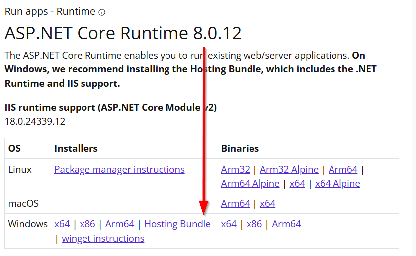
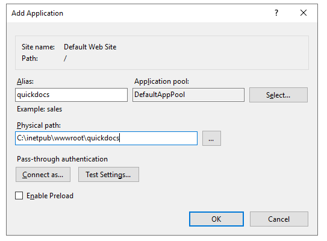

# Anleitung für die Einrichtung von QuickDocs auf IIS

Beschrieben ist die besipielhafte Einrichtung als (Unter-)App der "Default Web Site" eines IIS auf einem Windows Server.

Oben steht eine Kurzanleitung für eine schnelle Installation mit allen Standards und ohne Details, diese wird empfohlen, wenn bereits Erfahrung mit ASP\.NET Anwendungen besteht.

Darunter ist dann eine längere und ausführlichere Beschreibung der Schritte.

ℹ️ Ein Parallelbetrieb von mehreren QuickDocs-Installationen auf dem gleichen (Windows/IIS) Server ist ohne Probleme möglich.  
ℹ️ Dies bietet sich insb. dann an, wenn man verschiedene Vorlagen nutzt, auf die nicht alle Zugriff haben sollen (Rechte-Verwaltung).

[🔙 Zurück zur Übersicht](_toc.md)

## Kurzanleitung

-   **Voraussetzungen:** Installierter IIS, Release-Zip, Wordvorlage zum Testen
-   **Installation:**
    -   Release auf Server schieben, entpacken nach `C:\inetpub\wwwroot\quickdocs`.
    -   Datenordner anlegen: `C:\QuickDocs\Templates`, `C:\QuickDocs\Results`, `C:\QuickDocs\Temp`, `C:\QuickDocs\Logs`.
    -   Dem Benutzer `IIS_IUSRS` Vollzugriff auf `C:\QuickDocs` geben.
    -   Wordvorlagen (.docx) in `C:\QuickDocs\Templates` legen.
    -   In `C:\inetpup\wwwroot\quickdocs\appsettings.json`:
        -   `Config.Motd` auf einen Wert mit dem heutigen Datum setzen.
    -   QuickDocs-Lizenzdatei `C:\QuickDocs\wsqd.lic` ablegen.
-   **Einrichtung in IIS:**
    -   [🌐 ASP\.NET Core Runtime Hosting Bundle](https://dotnet.microsoft.com/en-us/download/dotnet/8.0) runterladen und installieren.
    -   IIS neustarten.
    -   Neuen AppPool einrichten mit Name `QuickDocs`, `kein verwalteter Code` wählen.
    -   Seite einrichten (falls nicht bereits besteht) mit `\*, 5001, http`.
    -   Neue Anwendung zur gewünschten Seite in IIS hinzufügen mit Pfad `C:\inetpub\wwwroot\quickdocs` und AppPool `QuickDocs`.
-   **Datenbank**
    -   `C:\inetpub\wwwroot\quickdocs\WS.QuickDocs.Api.Migrate.exe` ausführen.
-   **Testen:** http://localhost/quickdocs/swagger
-   **Beim Update auf neues Release:**
    -   Neues Release auf Server schieben
    -   Backup anlegen von
        -   `C:\inetpub\wwwroot\quickdocs\appsettings.json`
        -   `C:\inetpub\wwwroot\quickdocs\WS.QuickDocs.Api.runtimeconfig`
        -   `C:\inetpup\wwwroot\quickdocs\web.config`
        -   `C:\QuickDocs\Data.db`
    -   Seite/Anwendung/AppPool im IIS stoppen
    -   `C:\inetpub\wwwroot\quickdocs` mit neuem Release überschreiben.
    -   Konfiguration (Backup) prüfen auf Änderungen (neue Anleitung prüfen).
    -   Backup-Dateien aus `C:\inetpub\wwwroot\quickdocs` wieder einfügen und überschreiben.
    -   `C:\inetpub\wwwroot\quickdocs\WS.QuickDocs.Api.Migrate.exe` ausführen.

## Voraussetzungen

-   Installierter IIS
-   Aktuelles Release-Zip
-   Aktuelle QuickDocs-Lizenzdatei (`wsqd.lic`)
-   Zum Testen: 1 Wordvorlage

## Installation

Zuerst wird das Release auf dem Server entpackt und abgelegt und der sog. **Datenordner** wird vorbereitet.  
Bestehende Vorlagen können dabei direkt abgelegt werden.

-   **Release-Zip entpacken** nach `C:\inetpub\wwwroot\quickdocs`.
-   **Datenordner** anlegen:
    -   `C:\QuickDocs`
    -   `C:\QuickDocs\Templates`
    -   `C:\QuickDocs\Results`
    -   `C:\QuickDocs\Temp`
    -   `C:\QuickDocs\Logs`
-   Bestehende **Vorlagen** (Word-Dateien) in `C:\QuickDocs\Templates` ablegen.

## Konfiguration

Bis auf nötige Lizenzangaben ist die Anwendung im Auslieferungszustand mit allen Standardeinstellungen ausführbar.

In der Datei `C:\inetpub\wwwroot\quickdocs\appsettings.json` können verschiedene Standardeinstellungen angepasst werden.  
Zum Beispiel ist dort die Angabe anderer Ordnerpfade für die Datenordner.

Empfehlung: Die Eigenschaft `Config.Motd` (Message of the day) in einen beliebigen neuen Wert ändern, Beispiel: `QuickDocs 04.09.2024`.

Empfehlung: [📄 API-Token für die HTTP-Anfragen](../integration/api-auth.md) verwenden.  
Das nötige `Config.ApiTokenSecret` dafür auf ein einzigartiges, starkes Passwort/Secret setzen (mindestens 32 Zeichen).

Weitere Informationen: [📄 Settings](settings.md)

## QuickDocs-Lizenz

Die (gültige) QuickDocs Lizenzdatei in den Datenordner `C:\QuickDocs\wsqd.lic` ablegen.

Der genaue Pfad zur Lizenz kann in den [📄 Settings](settings.md) definiert werden.

## Einrichtung in IIS

Einmalig wird eine Runtime für IIS installiert.  
Danach werden Web Site und AppPool vorbereitet und dann wird QuickDocs als Anwendung hinzugefügt.

### Installation vom ASP\.NET Core Runtime (Core Bundle) 8.0

ℹ️ Einmalig nötig. Falls bereits installiert wird das Setup dies feststellen und die Installation beenden.

-   [🌐 ASP\.NET Core Runtime Hosting Bundle](https://dotnet.microsoft.com/en-us/download/dotnet/8.0) runterladen und installieren:
    
-   IIS **neustarten**
    -   Eingabeaufforderung (als Admin):
        `net stop was /y`  
        `net start w3svc`
    -   ℹ️ Kann auch später noch erfolgen, wird für die Ausführung von QuickDocs jedoch benötigt.

### AppPool einrichten

-   Empfehlung: Einen eigenen AppPool für QuickDocs einrichten, damit später Updates einfacher durchgeführt werden können.
-   Neuen AppPool hinzufügen
    -   Name: `QuickDocs`
    -   .NET CLR-Version: Kein verwalteter Code
-   ❗ Der AppPool-User braucht Rechte auf den Datenordner (Vorlagen, etc.)
    -   Die Identität braucht Schreibzugriff zu `C:\QuickDocs`
    -   Beispiel: `IIS_IUSRS (DEVELOP\IIS_IUSRS) = Vollzugriff auf C:\QuickDocs\`, wenn die `ApplicationPoolIdentity` verwendet wird.
-   ❗ Pro AppPool kann nur 1 ASP\.NET-Core Anwendung ausgeführt werden gleichzeitig.

### Seite einrichten

-   Entweder die "Default Web Site" verwenden
-   oder eine neue hinzufügen:
    -   IP-Adresse und Port zuweisen (Beispiel: \*, 5001, http)
-   Für **HTTPs**:
    -   SSL-Einstellungen: SSL erforderlich
    -   Bindung hinzufügen, Zertifikat auswählen

### Neue Anwendung zur gewünschten Seite in IIS hinzufügen

-   Physischer Pfad: `C:\inetpub\wwwroot\quickdocs`
-   AppPool auswählen  
    

## Datenbank

QuickDocs nutzt eine SQLite Datenbank.  
Zur Erstellung im Installationsverzeichnis die Migration starten.  
-> `C:\inetpub\wwwroot\quickdocs\WS.QuickDocs.Api.Migrate.exe`

❗ Für die Erstellung wird \.NET benötigt, welches mit dem Hosting Bundle mit installiert wurde.

Dies erstellt die Datenbank im Datenordner.  
Der genaue Pfad / `ConnectionString` kann in den [📄 Settings](settings.md) angepasst werden.

## Testen & Debuggen im Browser

Wurden alle Schritte oben ausgeführt, dann kann die Anwendung getestet werden.

-   http://localhost/quickdocs/swagger -> sollte die Swagger UI anzeigen. Hier können Funktionen direkt getestet werden.
    Funktioniert dies aus irgendeinem Grund nicht, dann:
-   http://localhost/quickdocs/status/ping -> sollte "Pong" ausgeben.

Zuerst kann man die **Logs** im QuickDocs-Datenordner, die **Windows Eventanzeige** oder die **IIS-Logs** prüfen.

Für ausführlichere Informationen kann das `MinimumLevel` des Loggers auf `Debug` gesetzt werden.  
Siehe [📄 Settings](settings.md#anpassung-des-log-level).

Weitere Analysen der Fehler sollten immer mit aktiviertem **Development-Modus**  
(siehe oben unter Konfiguration > Umgebungsvariablen > `ASPNETCORE_ENVIRONMENT`)  
durchgeführt werden.

Wird `HTTP Error 500.35 - ASP.NET Core does not support multiple apps in the same app pool` angezeigt muss für die Anwendung ein anderer/eigener AppPool konfiguriert werden.  
Siehe dazu den Abschnitt zur Einrichtung der App in IIS.

Bei **Problemen mit Zugriffsrechten** die Identität und Rechte vom verwendeten AppPool prüfen.  
Gleiches kann auch nötig sein, bei folgender Fehlermeldung `SQLite Error 8: 'attempt to write a readonly database'`

-   Die Identität braucht Schreibzugriff zu `C:\QuickDocs`
    -   Beispiel: `IIS_IUSRS (DEVELOP\IIS_IUSRS) = Vollzugriff auf C:\QuickDocs\`, wenn die `ApplicationPoolIdentity` verwendet wird.

Zum Testen ohne IIS kann auch direkt `C:\inetpub\wwwroot\quickdocs\WS.QuickDocs.Api.exe` ausgeführt werden.

-   Der Server läuft direkt auf http://localhost:5000.
-   Der Server läuft so lange das Fenster offen ist.

### Warnungen beim Starten

Üblicherweise werden beim Starten von QuickDocs 3 Warnungen ausgegeben (sowohl in der Konsole, als auch im Log).  
Die Meldungen sind nicht relevant für die Ausführung von QuickDocs und können ignoriert werden.

**Beispiel:**

```
Using an in-memory repository. Keys will not be persisted to storage.
Neither user profile nor HKLM registry available. Using an ephemeral key repository. Protected data will be unavailable when application exits.
No XML encryptor configured. Key {5f265c52-903c-4ba8-8bbd-a278da0683e9} may be persisted to storage in unencrypted form.
```

## Zusatz: Mehrere QuickDocs Instanzen auf einem Server

Es ist problemlos möglich, mehr als eine Instanz (eine Anwendung) von QuickDocs auf einem Windows-Server und innerhalb eines IIS zu installieren. Über mehrere Instanzen ist es auch möglich, bestimmte Vorlagen auf bestimmte Instanzen zu beschränken. Auf folgendes ist zu achten:

-   Jede Instanz ist komplett eigenständig/unabhängig zu betrachten und Ordner/Pfade/Ressourcen sollten nicht gemischt werden
    -   D.h. Anwendungsdaten (DLLs), Konfiguration, Vorlagen, Datenordner, Logs etc. ist alles getrennt.
    -   Systemweite Einstellungen wie die Umgebungsvariablen werden jedoch geteilt.
    -   Die QuickDocs Lizenz kann jedoch für alle Instanzen gleich sein (Kopie der Datei erstellen)
-   Pro Instanz / Installation benötigt es eine eigene Anwendung (mit eigenem Pfad) im IIS und einen zugehörigen AppPool.
-   Die jeweilige Instanz (der AppPool-User) braucht nur Rechte auf die Datenordner der jeweiligen Instanz, Beispiel:
    -   Instanz A: `IIS_IUSRS (DEVELOP\IIS_IUSRS) = Vollzugriff auf C:\QuickDocsA\` (`ApplicationPoolIdentity` wird verwendet)
    -   Instanz B: `USER_A (DEVELOP\USER_B) = Vollzugriff auf C:\QuickDocsB\`

## Update

⚠️ Beim Update werden alle Dateien von QuickDocs im Installationsverzeichnis ersetzt.  
Die ggf. angepassten benutzerdefinierten Inhalte von `appsettings.json`, `WS.QuickDocs.Api.runtimeconfig` und `web.config` sollten bei jedem Update gesichert und erhalten bleiben.

❗ Updates der REST-API sind nicht möglich, wenn die API von IIS gerade verwendet wird.  
Um die API zu stoppen, kann man entweder den verwendeten AppPool oder die Website stoppen (oder neustarten/recyclen).

❗ Alle Angaben beziehen sich auf die Standardpfade. Bitte [📄 Settings](settings.md) auf Anpassungen prüfen.

**Update-Vorgang:**

-   Aktuelles Release-Zip von Wertschöpfer erhalten.
-   Temporäres Release-Verzeichnis erstellen, für Backups und Arbeitsdateien.
-   Release-Zip auf den Server kopieren und in Release-Verzeichnis entpacken.
-   Backup von benutzerdefinierten Inhalten im Release-Verzeichnis erstellen:
    -   `C:\inetpub\wwwroot\quickdocs\appsettings.json`
    -   `C:\inetpub\wwwroot\quickdocs\WS.QuickDocs.Api.runtimeconfig`
    -   `C:\inetpup\wwwroot\quickdocs\web.config`
-   Backup von der Datenbank im Release-Verzeichnis erstellen:
    -   `C:\QuickDocs\Data.db`
-   Backup von etwaigen Extensions im Release-Verzeichnis erstellen:
    -   `C:\inetpub\wwwroot\quickdocs\Extensions\`
-   Benutzerdefinierten Inhalte im Release-Verzeichnis überprüfen.
    -   Die alten Dateien mit den neuen Dateien (im Release) vergleichen.
    -   Die aktuelle Installationsanleitung auf Neuerungen/Änderungen prüfen.
    -   Die neuen [📄 Settings](settings.md) prüfen.
-   In IIS den verwendeten AppPool oder die Website deaktivieren (der Host-Prozess muss gestoppt sein).
-   Alle Dateien im Installationsverzeichnis `C:\inetpub\wwwroot\quickdocs` löschen.
-   Alle entpackten Release-Dateien ins Installationsverzeichnis kopieren, alles überschreiben.
-   Wenn vorhanden: Alle zusätzlichen Erweiterungen wieder installieren oder aus dem Release-Verzeichnis (Backup) wiederherstellen.
-   Benutzerdefinierten Inhalte im Release-Verzeichnis ins Installationsverzeichnis verschieben, alles überschreiben.
-   Datenbank migrieren durch Ausführung von `C:\inetpub\wwwroot\quickdocs\WS.QuickDocs.Api.Migrate.exe`.
    -   Empfehlung: Mit einem Terminal starten, um die Ausgabe zu sehen.
-   In IIS den deaktivierten AppPool / die deaktivierte Website wieder aktivieren.
-   Temporäre Verzeichnisse / Backups ggf. löschen, Dateien bereinigen.
