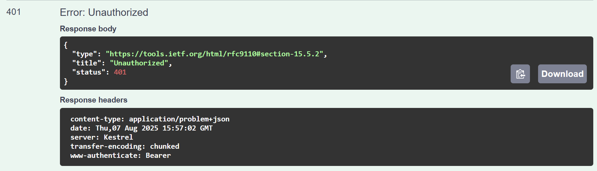
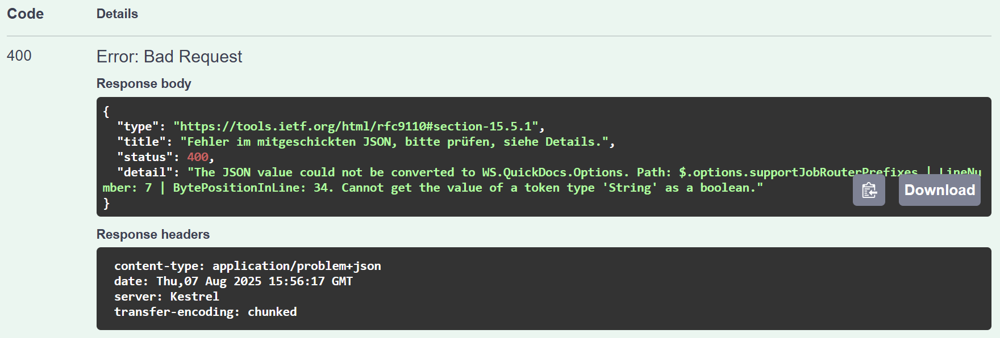
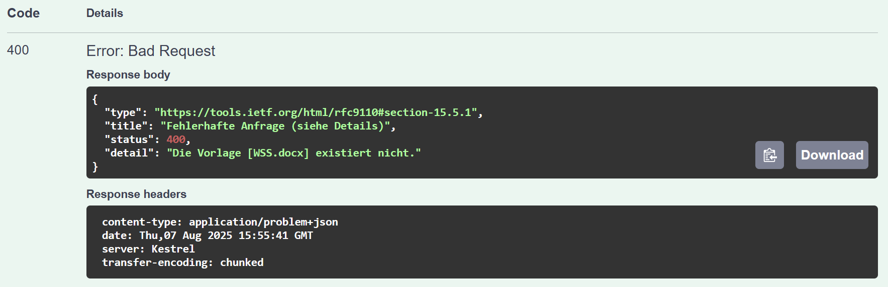

# Allgemeine Informationen zur API

[🔙 Zurück zur Übersicht](_toc.md)

## API Definition

QuickDocs bietet eine Swagger-/Open-API-Dokumentation direkt auf dem Server unter `/swagger` an: `https://<server>/quickdocs/swagger.`  
Hier sind alle vorhandenen HTTP-Endpunkte gelistet und beschrieben und können direkt getestet werden.

**Beispiel-Aufruf an QuickDocs mit cURL:**

```sh
curl -X 'POST' \
  'http://quickdocs.server/process/mapping/word?templateName=WS' \
  -H 'accept: */*' \
  -H 'Content-Type: application/json' \
  -d '{}'
```

## Development-Modus

Im Development-Modus (siehe [📄 Aktivierung im Handbuch für die Administration](./../admin/settings.md#umgebungsvariablen)) sind weitere Endpunkte vorhanden.

Diese Endpunkte sind mit einem `!` gekennzeichnet, zum Beispiel `/status/!/config`.  
Generell sind diese Endpunkte nur für temporäre Debug-Szenarien vorgesehen und sollten nicht dauerhaft produktiv eingesetzt werden.

Zusätzlich gibt QuickDocs im Development-Modus auch Fehlermeldungen an HTTP-Anfragen aus, beispielsweise, wenn ein erforderliches Mapping nicht richtig ist:

```cs
Microsoft.AspNetCore.Http.BadHttpRequestException: Failed to read parameter "Mapping mapping" from the request body as JSON.
```

## Fehlerfälle

Auf der Swagger-Seite ist für jeden Endpunkt definiert, was im Fehlerfall zu erwarten ist. In der Regel gibt die API ein JSON-Konstrukt mit Informationen zum Problem als `application/problem+json` zurück.

Externe Referenz: [🌐 https://swagger.io/blog/problem-details-rfc9457-api-error-handling/](https://swagger.io/blog/problem-details-rfc9457-api-error-handling/)

**Beispielrückgabe bei fehlendem API-Token**


**Beispielrückgabe bei fehlerhaften JSON-Body**


**Beispielrückgabe bei nicht existierender Vorlage**

