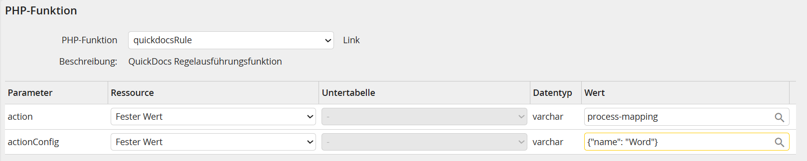

# Integration von QuickDocs in JobRouter

[🔙 Zurück zur Übersicht](_toc.md)

Eine der Hauptaufgaben von QuickDocs ist eine gute Integration in JobRouter Prozesse.  
Diese soll hier mit Beispielen und konkreten Anweisungen beschrieben werden.

-   [➡️ Vorbereitung](#vorbereitung)
    -   [➡️ Referenzimplementierung](#referenzimplementierung)
    -   [➡️ Konfigurationstabelle](#konfigurationstabelle)
    -   [➡️ Referenzprozess](#referenzprozess)
    -   [➡️ API-Definitionen](#api-definitionen)
    -   [➡️ Alternative: Manuelle Umsetzung](#alternative-manuelle-umsetzung)
-   [➡️ Einrichtung in einen neuen oder bestehenden Pozess](#einrichtung-in-einen-neuen-oder-bestehenden-pozess)
    -   [➡️ PHP-Dialogfunktion](#php-dialogfunktion)
    -   [➡️ PHP-Regelausführungsfunktion](#php-regelausführungsfunktion)
    -   [➡️ Dialog-JavaScript](#dialog-javascript)
-   [➡️ Anwendungsfälle](#anwendungsfälle)
    -   [➡️ Word-Vorlage im Dialog ausfüllen und in rechter Integration anzeigen](#word-vorlage-im-dialog-ausfüllen-und-in-rechter-integration-anzeigen)
    -   [➡️ Vorlagen mit Dialog verwalten](#vorlagen-mit-dialog-verwalten)

## Vorbereitung

### Referenzimplementierung

Für die schnelle Integration in JobRouter sollte zuerst unsere **Referenzimplementierung** 1x im JobRouter installiert werden.
Diese enthält nötige PHP- und JS-Kompontenten, sowie JobData-Tabellen, die dann von jedem Prozess aus genutzt werden.

Installiert wird die Referenzimplementierung (auch **QuickDocs Lib** genannt) im globalen `data`-Verzeichnis von JobRouter.  
Beispiel: `/var/www/html/jobrouter/data/quickdocs` für Linux-Server oder `C:\inetpup\wwwroot\jobrouter\data\quickdocs` für Windows-Server.  
Die Referenzimplementierung sollte nicht angepasst werden, da diese bei Updates ersetzt werden muss.  
Falls Abweichungen nötig sind, oder keine globale Installation gewünscht ist, können die Inhalte auch in den Prozess direkt kopiert werden und von dort direkt benutzt werden.

### Konfigurationstabelle

Zusätzlich zur Referenzimplementierung wird die QuickDocs-Konfigurationstabelle (JobData) im JobRouter - die **MD_QUICKDOCS_CONFIG** importiert.  
In dieser werden Einträge für individuelle Konfigurationen angelegt, die dann aus den Prozessen heraus genutzt werden.  
Standardmäßig sollte ein folgender Eintrag erstellt werden:

-   Konfiguration: `Standard` (Wird standardmäßig verwendet)
-   Server-URL (Basis): `<QuickDocs-API-Server-URL angeben>` Beispiel: `https://www.example.com/quickdocs`
-   API-Token: `<QuickDocs-API-Token>` wenn vorhanden, sonst leer lassen

### Referenzprozess

Als Orientierungs- und Starthilfe bieten wir den sogenannten **Referenzprozess** `ws_quickdocs` an, der auch zum Testen von QuickDocs genutzt werden kann.  
Der Prozess enthält eine Best-Practice-Implementierung und zeigt noch weitere Beispiele und alternative Möglichkeiten zur Verwendung der Referenzimplementierung für allgemeintaugliche Einsätze von QuickDocs auf.  
Die Dokumentation/Informationen in dem Prozess an zahlreichen Stellen der Implementierung sind ergänzend zu diesem Handbuch zu sehen.

Bei vorhandener Referenzimplementierung (s. o.) kann der Prozess einfach im JobRouter importiert werden und ohne weitere Konfiguration ausgeführt bzw. simuliert werden.

-   In der Konfigurationstabelle wird ein Eintrag mit Konfiguration `Standard` erwartet.
-   Schritt **100** `Verarbeitung eines Dokuments` demonstriert die Nutzung von QuickDocs im Dialog mit rechter Integration und per Regelausführungsfunktion

### API-Definitionen

Für die Entwicklung bieten wir sowohl für PHP- als auch für JS-Code API-Definitions-Dateien an.  
Diese API-Definitionen sollten in den jeweiligen Prozess eingefügt werden und bei Updates von QuickDocs ebenfalls geupdatet werden.  
Zur Laufzeit werden diese Dateien nicht benötigt, sie werden nur für die Entwicklung in IDEs wie Visual Studio Code für Auto-Complete etc. genutzt.

Alternativ kann man auch die Dateien der Referenzimplementierung im `data`-Verzeichnis in den Prozess reinkopieren und/oder einsehen.

### Alternative: Manuelle Umsetzung

Ohne Referenzimplementierung muss die Kommunikation mit dem QuickDocs-Server (via PHP und JavaScript) selbst gebaut werden.
Ohne Konfigurationstabelle können auch die Konfigurationswerte im PHP manuell gesetzt werden (zum Beispiel via. Prozesskonfigurationen).

Wir empfehlen für die Nutzung im Dialog, nicht direkt per AJAX im Browser die REST-API anzusprechen,  
sondern per `jr_execute_dialog_function` eine PHP Dialogfunktion für die Kommunikation zu QuickDocs zu verwenden. Dies hat 2 Vorteile:

-   Der Server, auf dem QuickDocs installiert ist, ist ggf. nicht vom Browser erreichbar.
-   Man hat eine bessere, zentralere Kontrolle über die Kommunikation mit QuickDocs und Zugriff auf alle Prozesstabellenfelder, Prozesskonfigurationen, etc.

Sofern der Server, auf dem QuickDocs läuft auch vom Browser aus erreichbar ist, kann QuickDocs auch direkt per JavaScript (`fetch/xhr/ajax`) im Browser aufgerufen werden.  
Manche Endpunkte/Routen der API können zudem auch direkt im Browser per URL (GET) aufgerufen werden.

Die folgende Einrichtung und Dokumentation bezieht sich immer auf die Verwendung der Referenzimplementierung.

## Einrichtung in einen neuen oder bestehenden Pozess

### PHP-Dialogfunktion

Eine PHP-Dialog-Funktion wird angelegt mit Namen `quickdocs`.  
Der Inhalt der gleichnamigen Funktion aus dem Referenzprozess wird in diese übernommen.

Die PHP-Funktion enthält einen empfohlenen Vorschlag für die Implementierung von `execute`.  
Dieser Vorschlag funktioniert bei Standardeinrichtung ohne weitere Anpassung, kann jedoch beliebig dem Prozess entsprechend angepasst werden.

=> Siehe die PHP-Dialogfunktion `quickdocs` im Referenzprozess.

### PHP-Regelausführungsfunktion

Natürlich ist neben einer PHP-Dialog-Funktion auch der Einsatz anderer Funktionen möglich.  
Der Vorgang ist der gleiche wie oben, nur dass die `execute`-Funktion entsprechend geändert werden muss.

Eine PHP-Dialog-Funktion wird angelegt mit Namen `quickdocsRule`.  
Zwei Parameter werden hinzugefügt mit Typ `Text`: `action` und `actionConfig`.  
Der Inhalt der gleichnamigen Funktion aus dem Referenzprozess wird in diese übernommen.

Die PHP-Funktion enthält einen empfohlenen Vorschlag für die Implementierung von `execute`.  
Dieser Vorschlag funktioniert bei Standardeinrichtung ohne weitere Anpassung, kann jedoch beliebig dem Prozess entsprechend angepasst werden.

An geeigneter Stelle im Prozess kann diese PHP dann per Regelausführungsfunktion aufgerufen werden.

-   Über den Parameter `action` wird die Aktion im PHP bestimmt, die QuickDocs bzw. die Funktion durchführen soll.
-   Über den Parameter `actionConfig` wird die Aktion via JSON weiter gesteuert bzw. konfiguriert.



=> Siehe die PHP-Regelausführungsfunktion `quickDocsRule` im Referenzprozess.
=> Siehe die Regel `PHP quickDocsRule` im Scrhitt `100 Verarbeitung eines Dokuments` im Referenzprozess.

### Dialog-JavaScript

Das Dialog-JavaScript wird benötigt, um die oben stehende PHP-Dialogfunktion optimal aufzurufen.

Dem Prozess wird ein (globales), externes JavaScript hinzugefügt:

-   Skriptname: QuickDocs
-   Typ: externes JavaScript
-   Dialog | Global: global
-   Pfad: `//data/quickdocs/QuickDocs.js`

Dies bindet die vorher installierte Referenzimplementierung in den Dialog ein.  
Wird das Skript nicht **global** erstellt, dann muss dies für jeden Dialog wiederholt werden.

Aus dem Dialog-JavaScript (App-Skript) kann QuickDocs dann über `QuickDocs.*` direkt verwendet werden.  
Alle aufzurufenden Dialog-Funktionen (die mit dem PHP kommunizieren) sind unter `QuickDocs.execute.*` zu finden.

=> Siehe die Dialog-JavaScript `App` im Dialog `process` im Referenzprozess.

## Anwendungsfälle

## Word-Vorlage im Dialog ausfüllen und in rechter Integration anzeigen

Siehe [📄 Verwendung und Funktionen der REST-API > Dokumentenverarbeitung](api-functions.md#dokumentenverarbeitung).

Die Prozesse müssen Mapping-Informationen (JSON) bereitstellen, diese an die REST-API schicken und dann die Ergebnisdateien (binär oder base64) verarbeiten.

In einem bestehenden Dialog wird ein FILE-Dialogelement erstellt.  
Dieses Dialogelement wird dann für die rechte Integration (mit oder ohne JobViewer) verwendet.

Per JavaScript wird dann die QuickDocs-PHP-Dialogfunktion angestoßen und das Ergebnis in das Attachment/File-Dialogelement gespeichert.  
Dabei wird auch die Integration rechts geladen.

Beispiel:

```js
QuickDocs.execute.process(
    'orderPdf', // Name des FILE-Elements im Dialog, welches das Dokument abspeichert
    'Auftrag.pdf', // Name der Ergebnis-Datei
    'Auftragsvorlage', // Name der Vorlage auf dem Server
    mapping // Mapping-Objekt
);
```

Zusätzlich dazu kann auch der `successCallback`, der `errorCallback` und die zu verwendende `dialogFunction` übergeben werden, falls diese Angaben vom Standard abweichen sollen.

Das Ergebnis ist eine direkte Vorschau der PDF innerhalb weniger Sekunden, ein Abschicken oder Neuladen des Dialogs entfällt.  
Während der Ausführung wird das standard JobRouter Lade-Popup angezeigt.

### Echtzeitverarbeitung

Hierbei handelt es sich um eine Erweiterung bei welcher beim Laden der Vorschau bzw. beim Aufruf von QuickDocs kein Lade-Popup angezeigt wird.  
Dies wird insbesondere dann empfohlen, wenn direkt auf Änderungen (on change) reagiert und QuickDocs angestoßen werden soll.

Für diesen Fall wird eine selbstentwickelte Alternative zu `jr_execute_dialog_function` verwendet.

Beispiel:

```js
QuickDocs.execute.processWithoutLoadingScreen(
    'orderPdf', // Name des FILE-Elements im Dialog, welches das Dokument abspeichert
    'Auftrag.pdf', // Name der Ergebnis-Datei
    'Auftragsvorlage', // Name der Vorlage auf dem Server
    mapping // Mapping-Objekt
);
```

Auch hier muss das Mapping-Objekt entsprechend der [📄 Dokumentenverarbeitung der API](api-functions.md#dokumentenverarbeitung) sein.

Das Ergebnis ist gleich wie bei der normalen Verarbeitung.

Da kein Lade-Popup angezeigt wird, sollte der Prozess/Dialog in diesem Fall selbst sicher stellen,  
dass die parallelen, asynchronen Anfragen an QuickDocs zum gewünschten Ergebnis führen.

### Ladebildschirm

Wird die Dokumentenverarbeitung in einem Dialog mit rechter Integration mehrfach aufgerufen kann es je nach Browser und Integrations-Art dazu kommen, dass die Integration nach der Verarbeitung erst kurz das letzte Ergebnisdokument anzeigt, während es das neue Dokument in die Integration lädt.  
Dieses Verhalten kann Benutzer:innen verwirren.

Um hier Abhilfe zu schaffen, stellen wir mit `QuickDocs.setIntegrationLoader()` kurzzeitig vor der Verarbeitung die Integration auf einen Ladekringel.

```js
// Wir setzen zuerst einen optionalen Ladekringel in die rechte Integration.
// Dies verhindet das kurzzeitige Anzeigen des letzten Ergebnis bei Mehrfachausführung.
QuickDocs.setIntegrationLoader();

// Danach führen wir die Standard QuickDocs-Dokumentenverarbeitung aus.
// Das Ergebnis überschreibt den Ladekringel und ist dann wie immer rechts zu sehen.
QuickDocs.execute.process('document', `Antrag.pdf`, 'Referenzvorlage', mapping);
```

### Automatisches / Unterstütztes Mapping

Für einen schnellen Start oder einfache Dialoge bieten wir den QuickDocs-Mappper in der Referenzimplementierung mit an.  
Dieser kann sowohl im JS als auch im PHP das Mapping generieren bzw. erweitern.

Beispiel im Dialog:

```js
// Verwendung des optionalen QuickDocs-Mapper für ein erstes Mapping.
// In diesem sind alle sichtbaren, nicht komplexen Elemente automatisch enthalten.
// Optional (erstes Argument = true) auch als `marker` statt standardmäßig `mergeFields`.
const mapping = QuickDocs.getAutoMapping();
QuickDocs.execute.process(
    'orderPdf', // Name des FILE-Elements im Dialog, welches das Dokument abspeichert
    'Auftrag.pdf', // Name der Ergebnis-Datei
    'Auftragsvorlage', // Name der Vorlage auf dem Server
    mapping // Mapping-Objekt
);
```

Der zusätzliche AutoMapper in der PHP-Dialogfunktion kann zusätzlich noch weitere Werte hinzufügen.  
Beispiel im Dialog:

```php
// Verwendung des optionalen QuickDocs-Mapper, um das vom Dialog übergeben Mapping zu ergänzen.
// Die Reihenfolge der `add*`-Befehle ist zu beachten, da bestehende Einträge nach unten überschrieben werden (Kaskadierung).
$mapping = (new QuickDocsDialogMapper($this))
    // Zuerst fügen wir Werte aus dem aktuellen Vorgang (Vorgangsnummer etc.) mit ein.
    ->addIncidentData(useMarker: false)
    // Dann fügen wir alle Tabellenwerte der Prozesstabelle mit ein.
    ->addTableValues(useMarker: false)
    // Dann fügen wir das vom Dialog erstellte Mapping ein.
    ->addMappingJson($mappingJson)
    // Zum Schluss fügen wir noch ein eigenes Mapping ein (im PHP definierte Werte).
    ->addMapping([
        "mergeFields" => [
            "EigenesFeld" => "Eigener Wert, der zusätzlich im Mapping ist"
        ]
    ])
    ->getMapping();

// Für die Verarbeitung muss das Mapping wieder in JSON umgewandelt werden.
$mappingJson = json_encode($mapping, JSON_PRETTY_PRINT);
```

Wichtig: Der QuickDocs-Mapper ist nur den Einsatz in Dialogen vorgesehen.  
Für die Verarbeitung in Folgeschritten-/regeln mit PHP empfehlen wir die Werte nach der Verarbeitung im Dialog zwischenzuspeichern.  
Für alle weitere Verarbeitung im Prozess abseits von Dialogen empfehlen wir die QuickDocs-Systemaktivität zu verwenden.

Beide Komponenten sowie die Zwischenspeicherung werden beispielhaft im Referenzprozess dargestellt.

## Vorlagen mit Dialog verwalten

Siehe [📄 Verwendung und Funktionen der REST-API > Vorlagenverwaltung](api-functions.md#vorlagenverwaltung).

Per REST-API können Vorlagen aus Prozessen aufgelistet, gelöscht, heruntergeladen, hochgeladen und inspiziert werden.
Zusätzlich zum direkten Verwenden von .docx-Dateien ist auch die Nutzung von Base64-Strings (für `jr_execute_dialog_function`) möglich.

Besondere Voraussetzungen gibt es keine, an beliebiger Stelle in Prozessen wird die die QuickDocs-PHP-Dialogfunktion angestoßen und das Ergebnis verarbeitet.

Beispiele:

```js
QuickDocs.execute.downloadTemplateNames(
    (response) => console.log(response.result.data) // Success-Handler mit den Namen aller Vorlagen als String-Array
);

QuickDocs.execute.downloadTemplate(
    'orderPdf', // Name des FILE-Elements im Dialog, welches das Dokument abspeichert
    'Auftrag.pdf', // Name der Ergebnis-Datei
    'Auftragsvorlage' // Name der Vorlage auf dem Server
);

QuickDocs.execute.uploadTemplate(
    'orderPdf', // Name des FILE-Elements im Dialog, welches das Dokument enthält
    'Auftragsvorlage', // Name der (neuen) Vorlage auf dem Server
    false // False (Standard) = Überschreibt bestehende Vorlagen nicht | True = Überschreibt bestehende Vorlagen.
);

QuickDocs.execute.deleteTemplate(
    'Auftragsvorlage' // Name der Vorlage auf dem Server
);

QuickDocs.execute.inspectTemplate(
    'Auftragsvorlage', // Name der Vorlage auf dem Server
    (response) => console.log(response.result.data) // Success-Handler, mit dem Ergebnis der Inspektion als (JSON) Objekt
);
```

Zusätzlich kann auch der jeweilige `successCallback`, der `errorCallback` und die zu verwendende `dialogFunction` übergeben werden,  
falls diese Angaben vom Standard abweichen sollen.
